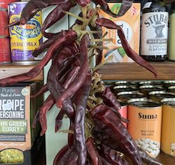

<ul style="float:left; color:#6b9b7e">
<li>Bread</li>
<li>Milk</li>
<li>Newspapers</li>
<li>Groceries</li>
<li>Delicattessen</li>
<li>Locally made sandwiches</li>
<li>Locally made pies and cooked meat</li>
<li>Frozen foods</li>
<li>Yorkshire specialities</li>
<li>Wines and spirits</li>
<li>Cigarettes</li>
</ul>

 
 

