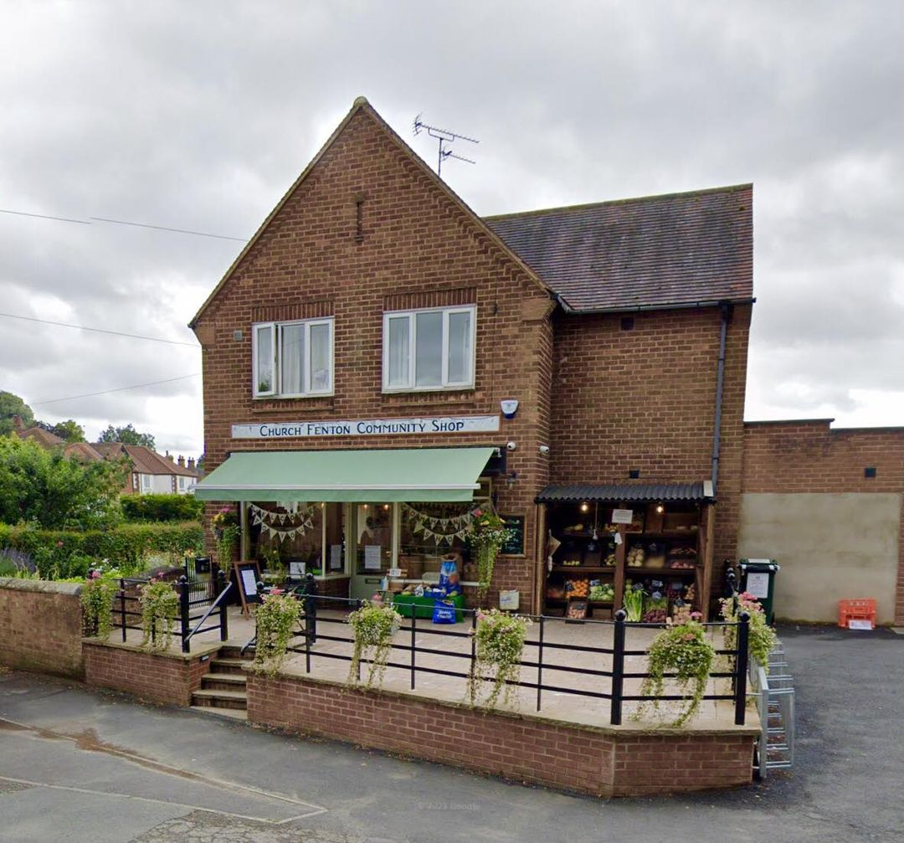
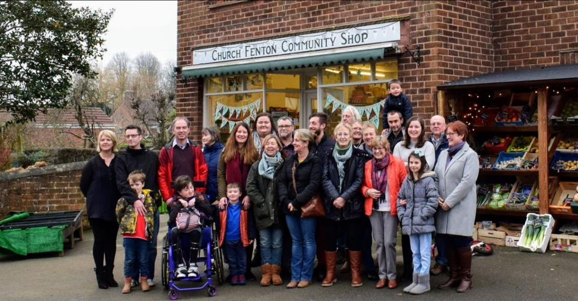
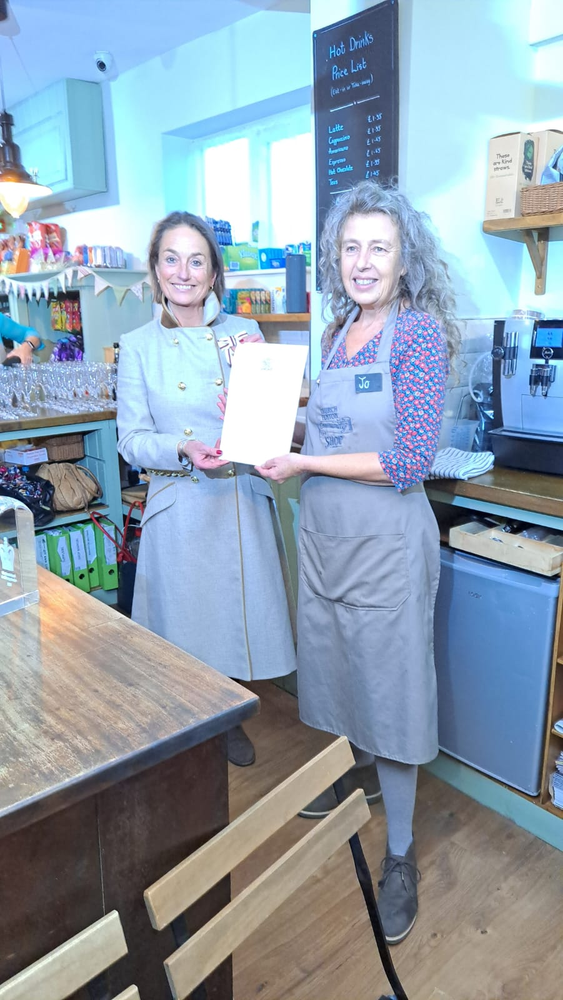

<h3>Run by the community for the community</h3>

{: width="350" height= "auto" align="right" class="img-responsive}
* run entirely by volunteers - everyone
* wide range of products covering basic grocery items to delicatessen items
* serving the village, surrounding areas and visitors
* profit re-invested in the shop or used for local causes

{: width="350" height="auto" class="img-responsive"}

We received the **Queen's Award for Volunteering** in 2022 - the highest level of recognition open to us.  The award was presented by The Lord-Lieutenant of North Yorkshire, Jo....
{:  width="200px" height="auto" class="img-responsive" style="float:right"}

{:style="text-align:center;}
{:  width="350px" height="auto" class="img-responsive}
[{: width="350px" height="auto" class="img-responsive}](https://bbc.co.uk)
{: width="200" height="auto" class="img-responsive}